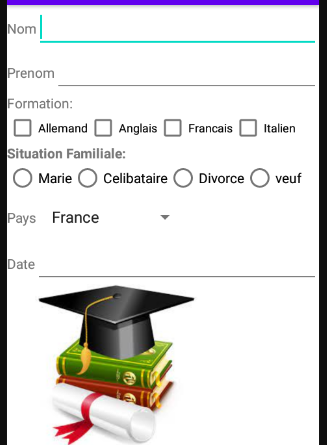

= TRAVAUX PRATIQUES ANDROID

== 1) Creez un projet android que l’on nomme TP01androidHelloWorld avec une empty activity

== 2) Indiquez a quoi serve chacun des dossiers  et des fichiers suivants:
AndroidManifest.xml? +
Java? +
Res? +
Drawable? +
Layout? +
Mipmap? +
Values? +
gradle scripts? +

== 3) Créez un émulateur de type pixel4, avec l’image nougat

== 4) En utilisant des LinearLayout realisez l’écran suivant, et internationalisez l’application avec une version anglaise

[source,kotlin]
----
import android.graphics.Color
import android.os.Bundle
import android.util.TypedValue
import android.widget.*
import androidx.appcompat.app.AppCompatActivity

class MainActivity : AppCompatActivity() {
// On définit les ViewGroup(LinearLayout, RadioGroup.. ),
// et les Views (TextView, EditText,..)
private lateinit var layout: LinearLayout
private lateinit var text1: TextView
private lateinit var text2: TextView
private lateinit var editText1: EditText
private lateinit var editText2: EditText
private lateinit var checkBox1: CheckBox
private lateinit var checkBox2: CheckBox
private lateinit var radioGroup: RadioGroup
private lateinit var radioButton1: RadioButton
private lateinit var radioButton2: RadioButton
private lateinit var spinner: Spinner
private lateinit var adapter: ArrayAdapter<*>
private val pays = arrayOf("France", "Espagne", "Italie", "Ukraine")
private lateinit var toggleButton1: ToggleButton
private lateinit var toggleButton2: ToggleButton
private lateinit var imageView: ImageView
private lateinit var layoutParams: LinearLayout.LayoutParams // define dimensions

    override fun onCreate(savedInstanceState: Bundle?) {
        super.onCreate(savedInstanceState)
        // init Layout
        layout = LinearLayout(this)
        layout.orientation = LinearLayout.VERTICAL
        // TextView
        text1 = TextView(this)
        text1.text = "Text 1"
        text2 = TextView(this)
        text2.text = "Text 2"
        // EditText
        editText1 = EditText(this)
        editText2 = EditText(this)
        // CheckBox
        checkBox1 = CheckBox(this)
        checkBox1.setText(R.string.francais)
        checkBox2 = CheckBox(this)
        checkBox2.setText(R.string.anglais)
        // RadioGroup
        radioGroup = RadioGroup(this)
        radioGroup.orientation = LinearLayout.HORIZONTAL
        radioButton1 = RadioButton(this)
        radioButton1.setText(R.string.marie)
        radioButton2 = RadioButton(this)
        radioButton2.setText(R.string.celibataire)
        radioGroup.addView(radioButton1)
        radioGroup.addView(radioButton2)
        // init model for spinner
//        String [] pays = {this.getString(R.string.francais),
//                            this.getString((R.string.anglais)),
//                                    this.getString((R.string.italie))};
        val pays = resources.getStringArray(R.array.list)
        // Spinner
        spinner = Spinner(this)
        adapter = ArrayAdapter<Any?>(
            this,
            android.R.layout.simple_list_item_1,
            pays
        )
        spinner.adapter = adapter

        // ToggleButton
        toggleButton1 = ToggleButton(this)
        toggleButton1.text = "Active"
        toggleButton2 = ToggleButton(this)
        toggleButton2.text = "Off"

        // ImageView
        imageView = ImageView(this)
        imageView.setImageResource(R.drawable.raw)
        layoutParams = LinearLayout.LayoutParams(
            LinearLayout.LayoutParams.WRAP_CONTENT,
            LinearLayout.LayoutParams.WRAP_CONTENT
        )
        editText1.layoutParams = layoutParams
        // SP est une unité indépendante de la résultion de l'écran qui
        // depend des preferences utilisateur que on applique
        // aux tailles de caractères size in float
        text1.setTextSize(TypedValue.COMPLEX_UNIT_SP, 40f)
        text1.setTextColor(Color.BLUE)

        // add view into viewGroup
        layout.addView(text1)
        layout.addView(text2)
        layout.addView(editText1)
        layout.addView(editText2)
        layout.addView(checkBox1)
        layout.addView(checkBox2)
        layout.addView(radioGroup)
        layout.addView(spinner)
        layout.addView(toggleButton1)
        layout.addView(toggleButton2)
        layout.addView(imageView)
        setContentView(layout)
        //on supprime le lien par generé par défaut vers activity_main layout
        //        setContentView(R.layout.activity_main);
    }
}
----

=== _EXERCICE 1:_
En partant de l’activity realise hier, enlever l’image et ajouter un bouton qui permet +
de recuperer la liste des informations saisies et les afficher dans le LOGCAT.

=== _EXERCICE2:_
En partant de l’activity realise hier, enlever l’image et ajouter un bouton qui permet +
de recuperer la liste des informations saisies et les afficher dans le LOGCAT. +
(remplacez la suite des if qui permettent de tester si un bouton radio +
ou un chekbox a ete coche par une boucle)

=== _EXERCICE3:_
Creez une classe qui va permettre de creez des objets qui permettront de stocker les valeurs +
saisies dansl’activity. Lorsque on clique sur le bouton , un objet est  crée avec les valeurs +
saisies dans l’activity , et sera stocke dans un ArrayList qui sera affiche dans le logcat.